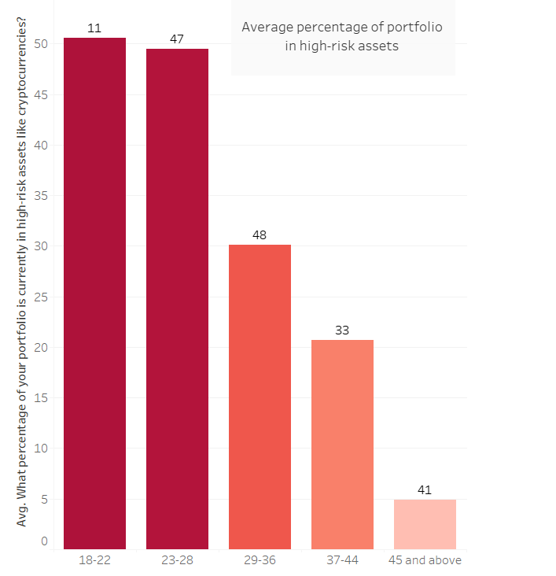
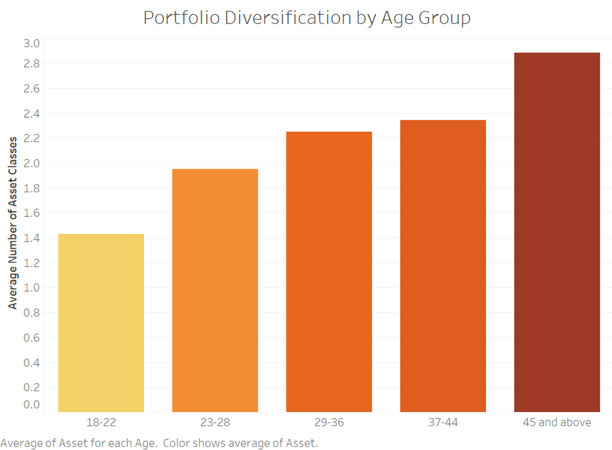

# Group Research Project Report

## Team Members:
1. Khilji Syed Izhan
2. Kaszas Tunde Lilla
3. Nguyen Quang Anh 
4. Malchiodi Marco

## Declaration
...

## Introduction
...

## Methodology
... 

## Results

### Investment in High-Risk Assets  

 

One of the aspects we researched was the relationship between age and risky investments. Our results strongly supported the hypothesis that younger generations are more comfortable with high-risk investments and are more likely to populate their portfolios with assets such as cryptocurrencies, NFTs, and other speculative instruments. In Figure 1, we illustrate the average comfort level of each age group with investing in high-risk assets, measured on a scale of 1-5. Responses showed that the youngest age groups (18-22 and 23-28) exhibited the highest comfort levels, with an average rating of 4.5. We attribute this to a combination of lower financial literacy and higher internet literacy. The accessibility of online resources and the influence of social media likely reduce the perceived intimidation associated with the volatility of such assets. As expected, the comfort level progressively decreases with age. 

 

Figure 2 presents the average percentage of high-risk assets within each age group’s portfolio. The largest proportion (approximately 51%) is associated with the youngest age group (18-22), followed closely by the 23-28 group at 49%. This proportion decreases to 30%, 21%, and finally 5% for the oldest age group (45+). This distribution demonstrates a stark contrast: the youngest groups tend to "put their eggs in one basket," while older groups deliberately avoid high-risk assets. Several factors may explain this pattern. Younger adults, with comparatively less disposable income, are drawn to higher returns despite the associated risks. Meanwhile, older generations, benefiting from stable incomes and accumulated assets, prioritize diversified portfolios with moderate risks to achieve long-term financial stability. 
### Portfolio Diversification
Our findings strongly support the hypothesis that as investors age, they diversify their portfolios across a broader range of asset classes. 

Figure 1 (Portfolio Diversification by Age Group) highlights a clear trend: younger investors average only 1.2 asset classes in their portfolios, emphasizing concentrated investments, often in high-risk, high-reward assets. In contrast, older investors, particularly those aged 45 and above, average 2.8 asset classes, showcasing a deliberate approach to risk mitigation and stability through diversification.

For younger age groups, limited diversification appears influenced by two key factors:

- **Constrained Disposable Income:** Drives them toward investments promising higher returns, despite the inherent risks.
- **Internet and Social Media Influence:** Encourages preference for speculative assets like cryptocurrencies frequently marketed as lucrative opportunities.

In contrast, older investors prioritize reducing exposure to risk. 

As depicted in Figure 2 (Average Crypto Allocation), the allocation to high-risk assets like cryptocurrencies declines sharply with age. The youngest group allocates over 50% of their portfolios to these assets, whereas this drops to under 5% for the 45+ age group. This shift underscores a transition from speculative strategies to diversified portfolios aligned with long-term financial stability, demonstrating distinct generational approaches to investment.

 
## Discussion
One of the aims of this research was to compare our findings with pre-existing literature. However, it soon became apparent that past studies on the subject, particularly on the behavioral aspects of investors, labeled as ‘investor’ those entities that were either financial institutions or high-net-worth individuals, - the traditional market makers and movers. Our survey, on the other hand, targeted exclusively the so-called ‘retail investors’, individuals who may lack market influence on their own, but are a significant player as an aggregate. It is safe to assume that this would add value to our work. 

Some challenges included possible biases from the respondents’ backgrounds: the number respondents predominantly fell between the range of ages 28-36, very few being younger than 22. As a noticeable amount of respondents were non-Hungarian citizens, there may have also been some misunderstandings regarding the questions related to income in HUF. Other background data, mainly related to marital status, education, annual income, number of dependents etc., was surprisingly evenly distributed amongst the respondents. This made the following analysis more fair, but might also be an indicator of bias from the respondents’ background. 

The findings strongly supported our initial hypotheses: younger individuals were more likely to adopt riskier investment strategies (such as by investing in highly volatile assets like cryptocurrencies) and generally showed lower levels of financial literacy. Unfortunately, data on actual financial experience could not be used as a benchmark as most responses pointed at one to three years of investment experience, the latter being a potential substitute for financial literacy. 

Interesting enough, despite younger respondents generally having a perception of themselves as ‘risk takers’, as was proven by the data related to risk comfort levels, many questions that presented hypothetical scenarios regarding guaranteed low term losses (or gains) vs long term potential losses (or gains), were often met by younger investors with the most short-sighted response. This may show that younger people, despite initially opting for more volatile assets, may eventually quit their positions at the first hint of financial loss. This stands in clear juxtaposition to older investors, who, being more likely to pursue conservative strategies, tend to nonetheless opt for long term investments. This, too, supports our hypothesis that lower financial literacy is related to riskier investments. 

## Conclusion

This study showcased key insights into age-based investment behaviors, providing actionable opportunities for financial service providers to refine their offerings. Younger investors, characterized by a high tolerance for risk and a strong preference for speculative assets like cryptocurrencies, represent a growing but underserved segment. Conversely, older investors, who prioritize diversification and risk mitigation, align more closely with traditional financial products.

To capture the younger market, financial service providers should develop targeted products that balance high-growth opportunities with stability. This could include hybrid portfolios combining speculative and conventional assets, supported by interactive platforms that resonate with their digital fluency. Additionally, financial literacy tools embedded within these platforms can help younger investors better understand risk management and portfolio diversification.

For older clients, providers should focus on personalized advisory services that emphasize stability and risk management. Automated portfolio diversification tools, income-focused investment strategies, and conservative high-yield options can address their long-term financial goals while maintaining engagement.

Aligning financial services with the distinct needs of these generational segments not only improves customer satisfaction but also drives retention and profitability. By integrating these strategies, financial service providers can position themselves as leaders in delivering tailored, effective solutions that adapt to evolving market demands. 

## Reflection

Our team effectively implemented Agile principles through structured weekly meetings and ongoing communication in a dedicated group chat. The meetings provided a platform to review progress, discuss challenges, and plan next steps, ensuring that everyone remained aligned and engaged. The group chat served as a space for quick clarifications, sharing insights, and resolving questions, which kept the workflow efficient.

Workload distribution was equitable, with all members contributing equally to the project. This balance ensured accountability and made sure that everyone was actively involved in the process. Open discussions during meetings encouraged critical thinking and allowed different perspectives to shape our decisions, ultimately improving the quality of our work.

Despite these strengths, we encountered challenges such as occasional scheduling conflicts and the difficulty of balancing project tasks with other commitments. However, the team’s adaptability and proactive communication helped us navigate these obstacles effectively. For example, when a team member faced time constraints, others stepped in to provide support, ensuring that deadlines we set were met without compromising quality.

By embracing Agile principles, we created a collaborative, flexible environment that not only overcame challenges but also enhanced the overall quality and efficiency of our work.

## References
... 
